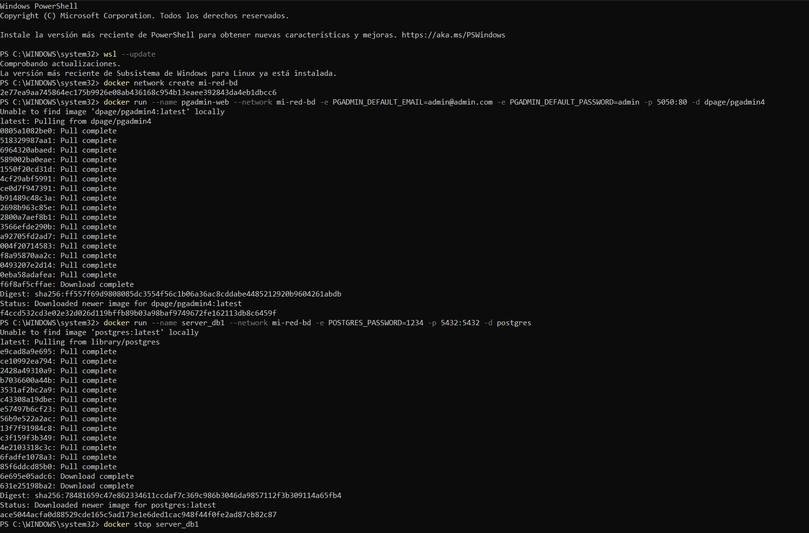
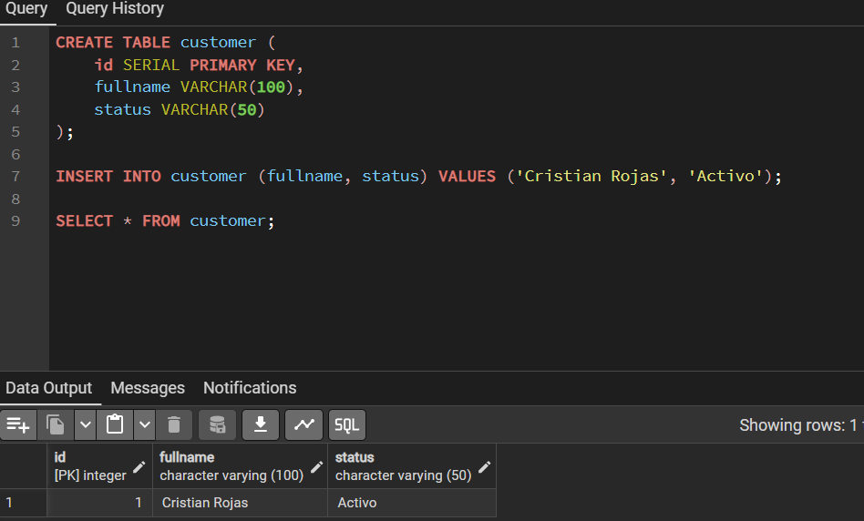
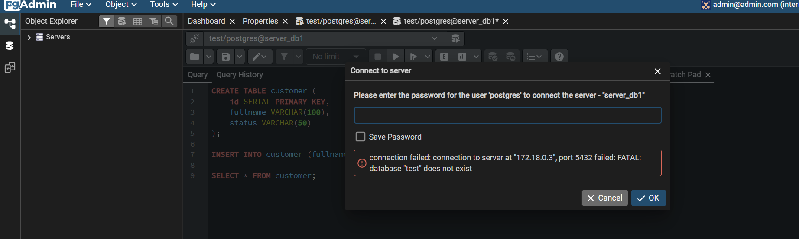
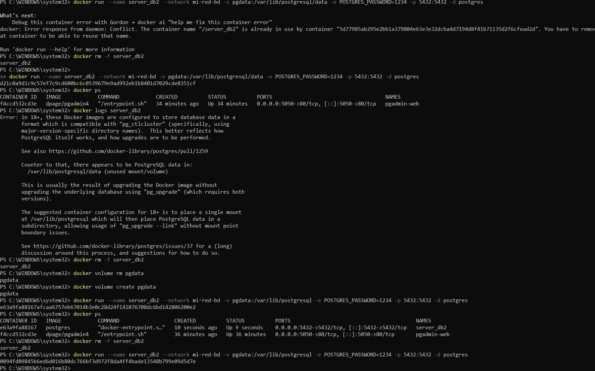
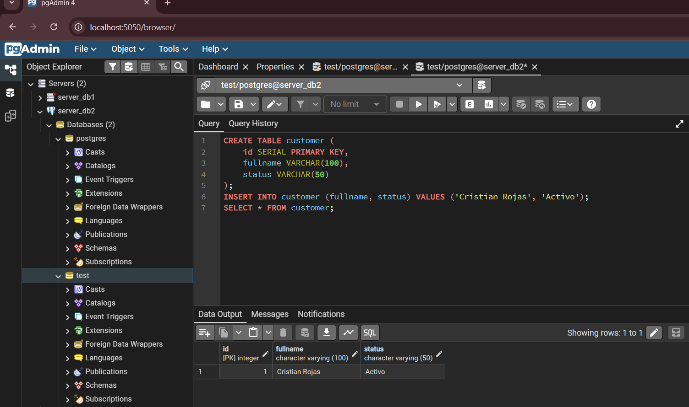
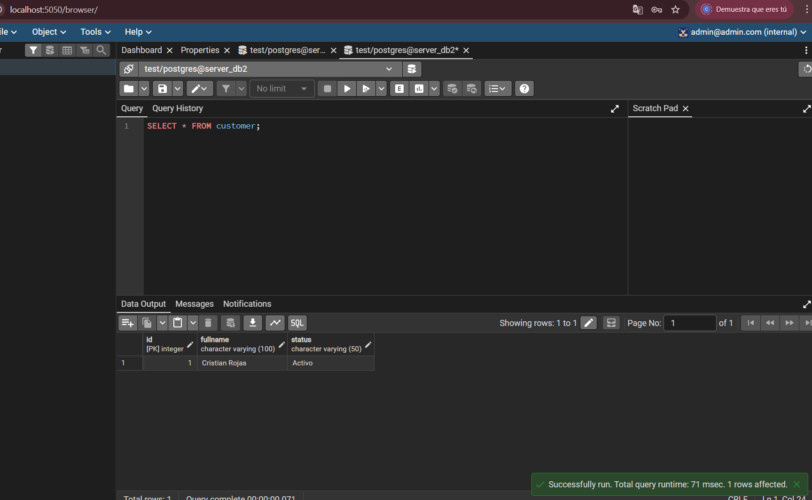

 Práctica No. 3: Persistencia de Datos con Docker y PostgreSQL 

**Autor:** Christian Rojas  
**Institución:** Instituto Sudamericano  
**Ciclo:** Cuarto - Tecnología en Desarrollo de Software  
**Materia:** Tendencias tecnologicas

---

## 1. Título
**Persistencia de Datos con Volúmenes en Docker y PostgreSQL**

---

## 2. Tiempo de Duración
Aproximadamente **90 minutos**

---

## 3. Fundamentos

Docker es una plataforma de virtualización a nivel de sistema operativo que permite ejecutar aplicaciones en contenedores aislados. A diferencia de las máquinas virtuales tradicionales, los contenedores comparten el kernel del sistema operativo anfitrión, lo que los hace mucho más ligeros y eficientes en el uso de recursos.

Un **contenedor Docker** es una instancia en ejecución de una imagen. Las imágenes son plantillas de solo lectura que contienen el sistema de archivos y la configuración necesaria para ejecutar una aplicación. Cuando un contenedor se elimina, todos los datos generados dentro de él también se eliminan, ya que el sistema de archivos del contenedor es efímero por naturaleza.

Esta característica representa un problema cuando se trabaja con bases de datos: si eliminamos el contenedor de PostgreSQL, perdemos toda la información almacenada. Para solucionar esto, Docker ofrece el concepto de **volúmenes**.

Un **volumen Docker** es un mecanismo de persistencia de datos que existe independientemente del ciclo de vida del contenedor. Los volúmenes son gestionados directamente por Docker y se almacenan en una parte del sistema de archivos del host (`/var/lib/docker/volumes/` en Linux). Esto significa que aunque el contenedor sea eliminado, el volumen y sus datos permanecen intactos y pueden ser montados en un nuevo contenedor.

**PostgreSQL** es un sistema de gestión de bases de datos relacional de código abierto, reconocido por su robustez, soporte a estándares SQL y extensibilidad. Al ejecutarlo dentro de Docker, se puede levantar rápidamente una instancia sin necesidad de instalación directa en el sistema operativo.

Los conceptos clave para esta práctica son:

- **Imagen Docker**: Plantilla base para crear contenedores (ej: `postgres:latest`).
- **Contenedor**: Instancia en ejecución de una imagen.
- **Volumen**: Almacenamiento persistente desacoplado del contenedor.
- **Puerto de mapeo (`-p`)**: Permite acceder al servicio dentro del contenedor desde el host (ej: `5432:5432`).
- **Variables de entorno (`-e`)**: Configuran parámetros como usuario y contraseña de PostgreSQL al iniciar el contenedor.


*Figura 1-1. Arquitectura de contenedores Docker con y sin volúmenes.*

---

## 4. Conocimientos Previos

Para realizar esta práctica, el estudiante necesita tener claros los siguientes temas:

- Comandos básicos de Linux/terminal (cd, ls, mkdir, etc.)
- Conceptos básicos de bases de datos relacionales (tablas, registros, SQL)
- Manejo básico de navegador web
- Qué es una dirección IP y un puerto de red
- Instalación y uso básico de Docker Desktop o Docker CLI

---

## 5. Objetivos a Alcanzar

- Crear contenedores PostgreSQL con Docker desde la línea de comandos.
- Comprobar la pérdida de datos al eliminar un contenedor sin volumen asociado.
- Implementar volúmenes Docker para garantizar la persistencia de datos.
- Conectar un cliente de base de datos (DataGrip / TablePlus / pgAdmin) a un contenedor.
- Verificar la persistencia de datos tras eliminar y recrear un contenedor con volumen.

---

## 6. Equipo Necesario

- Computador con sistema operativo Windows, Linux o macOS
- Docker Desktop instalado (versión 20.x o superior)
- Cliente de base de datos: DataGrip, TablePlus o pgAdmin 4
- Conexión a internet para descargar la imagen de PostgreSQL
- Terminal o PowerShell

---

## 7. Material de Apoyo

- [Documentación oficial de Docker](https://docs.docker.com/)
- [Documentación oficial de PostgreSQL](https://www.postgresql.org/docs/)
- Guía de asignatura de Sistemas Operativos
- Cheatsheet de comandos Linux
- [Docker Hub - imagen PostgreSQL](https://hub.docker.com/_/postgres)

---

## 8. Procedimiento

### 🔴 Parte 1: Base de Datos SIN Volumen

**Paso 1:** Crear el contenedor PostgreSQL `server_db1` sin volumen.

```bash
docker run --name server_db1 -e POSTGRES_PASSWORD=1234 -e POSTGRES_USER=admin -p 5432:5432 -d postgres
```


*Figura 1-2. Creación del contenedor server_db1 sin volumen.*

---

**Paso 2:** Conectar el administrador de base de datos (DataGrip/TablePlus) al contenedor `server_db1` usando:
- Host: `localhost`
- Puerto: `5432`
- Usuario: `admin`
- Contraseña: `1234`


*Figura 1-3. Conexión exitosa al contenedor server_db1 desde el administrador de base de datos.*

---

**Paso 3:** Crear la base de datos `test` y la tabla `customer`.

```sql
CREATE DATABASE test;

\c test

CREATE TABLE customer (
    id SERIAL PRIMARY KEY,
    fullname VARCHAR(100),
    status VARCHAR(20)
);

INSERT INTO customer (fullname, status) VALUES ('Christian Rojas', 'activo');
```


*Figura 1-4. Creación de la base de datos test, tabla customer e inserción de registro.*

---

**Paso 4:** Detener y eliminar el contenedor `server_db1`.

```bash
docker stop server_db1
docker rm server_db1
```

---

**Paso 5:** Recrear el contenedor con el mismo nombre y verificar que los datos ya no existen.

```bash
docker run --name server_db1 -e POSTGRES_PASSWORD=1234 -e POSTGRES_USER=admin -p 5432:5432 -d postgres
```


*Figura 1-5. Verificación: la base de datos test ya no existe, los datos se perdieron.*

---

### 🟢 Parte 2: Base de Datos CON Volumen

**Paso 6:** Crear el volumen Docker.

```bash
docker volume create pgdata
```

---

**Paso 7:** Crear el contenedor `server_db2` asociando el volumen `pgdata`.

```bash
docker run --name server_db2 -e POSTGRES_PASSWORD=1234 -e POSTGRES_USER=admin -p 5433:5432 -v pgdata:/var/lib/postgresql/data -d postgres
```


*Figura 1-6. Creación del contenedor server_db2 con volumen pgdata asociado.*

---

**Paso 8:** Conectarse al contenedor, crear la base de datos `test`, la tabla `customer` e insertar registros (mismos pasos que en la Parte 1, ahora en el puerto `5433`).

```sql
CREATE DATABASE test;
\c test
CREATE TABLE customer (
    id SERIAL PRIMARY KEY,
    fullname VARCHAR(100),
    status VARCHAR(20)
);
INSERT INTO customer (fullname, status) VALUES ('Christian Rojas', 'activo');
```

---

**Paso 9:** Detener y eliminar el contenedor `server_db2`.

```bash
docker stop server_db2
docker rm server_db2
```

---

**Paso 10:** Recrear el contenedor `server_db2` usando el mismo volumen `pgdata` y verificar que los datos persisten.

```bash
docker run --name server_db2 -e POSTGRES_PASSWORD=1234 -e POSTGRES_USER=admin -p 5433:5432 -v pgdata:/var/lib/postgresql/data -d postgres
```


*Figura 1-7. Verificación: la base de datos test y los registros persisten gracias al volumen.*

---

## 9. Resultados Esperados

Al finalizar la práctica se comprobó que:

- **Sin volumen**: Al eliminar el contenedor `server_db1` y recrearlo, la base de datos `test` y todos sus registros desaparecen completamente. Esto demuestra la naturaleza efímera de los contenedores Docker.

- **Con volumen**: Al eliminar el contenedor `server_db2` y recrearlo usando el volumen `pgdata`, la base de datos `test`, la tabla `customer` y todos los registros insertados permanecen intactos. El volumen actúa como almacenamiento independiente del contenedor.

Esta práctica demuestra la importancia de usar volúmenes Docker en entornos de producción donde la persistencia de datos es fundamental.

---

## 10. Bibliografía

Docker Inc. (2024). *Docker Documentation - Volumes*. Recuperado de https://docs.docker.com/storage/volumes/

PostgreSQL Global Development Group. (2024). *PostgreSQL Documentation*. Recuperado de https://www.postgresql.org/docs/

Turnbull, J. (2014). *The Docker Book: Containerization is the new virtualization*. James Turnbull.

---

